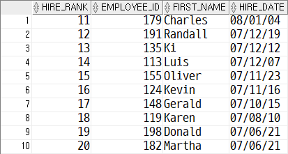

# SQL 활용 및 응용

## 1. EMPLOYEES 테이블과 DEPARTMENTS 테이블을 join하여 EMPLOYEE_ID, FIRST_NAME, DEPARTMENT_NAME 을 출력하세요.
```sql
SELECT e.employee_id, e.first_name, d.department_name
FROM employees e, departments d
WHERE e.department_id = d.department_id;
```

## 2. EMPLOYEES 테이블과 DEPARTMENTS 테이블, JOBS 테이블을 join하여 EMPLOYEE_ID, FIRST_NAME, DEPARTMENT_NAME, JOB_TITLE 을 출력하세요.
```sql
SELECT s.employee_id, s.first_name, s.department_name, j.job_title
FROM (SELECT e.employee_id, e.first_name, e.job_id, d.department_name
      FROM employees e, departments d
      WHERE e.department_id = d.department_id) s, jobs j
WHERE s.job_id = j.job_id;
```

## 3. EMPLOYEES 테이블과 JOBS 테이블을 join하여 EMPLOYEE_ID, FIRST_NAME, JOB_TITLE, SALARY, MIN_SALARY, MAX_SALARY 을 출력하세요.
```sql
-- 일반 조회 테이블 + 최소값, 최대값 테이블
SELECT *
FROM (SELECT employee_id, first_name, job_title, salary
      FROM employees, jobs
      WHERE employees.job_id = jobs.job_id),
     (SELECT MIN(salary) as MIN_SALARY, MAX(salary) as MAX_SALARY
      FROM EMPLOYEES);
```
  
## 4. EMPLOYEES 테이블에서 EMPLOYEE_ID가 114 인 사람의 SALARY 보다 많은 사람의 EMPLOYEE_ID, FIRST_NAME, SALARY 를 출력하세요.
```sql
SELECT employee_id, first_name, salary
FROM (SELECT salary as his_salary FROM employees WHERE employee_id = 114), employees
WHERE salary > his_salary;
```
## 5. EMPLOYEES 테이블 DEPARTMENTS 테이블을 사용하여 EMPLOYEE_ID가 114인 사람과 같은부서 사람의 명단을 EMPLOYEE_ID, FIRST_NAME, DEPARTMENT_NAME 을 출력하세요.
```sql
SELECT e.employee_id, e.first_name, d.department_name
FROM (SELECT department_id as his_dep FROM employees WHERE employee_id = 114) h, employees e, departments d
WHERE e.department_id = h.his_dep AND e.department_id = d.department_id;
```
## 6. EMPLOYEES 테이블 사용하여  입사일 HIRE_DATE 최근일부터 11번째 부터 20번째인 사람의 EMPLOYEE_ID, FIRST_NAME, HIRE_DATE 을 출력하세요.
```sql
-- rank() 함수 사용
-- rank()는 중복 순위를 허용한다. (ex 19등 2명, 20등 0명)
SELECT employee_id, first_name, hire_date
FROM (SELECT rank() OVER (ORDER BY hire_date DESC) as hire_rank, employee_id, first_name, hire_date
      FROM employees)
WHERE hire_rank BETWEEN 11 AND 20;
```
>  
>rank( ) 사용시 hire_rank 값
```sql
-- rownum 사용
-- rownum은 정렬된 순서대로 부여하며, 중복 순위가 없다.
SELECT employee_id, first_name, hire_date
FROM (SELECT ROWNUM as hire_rank, hire_date, employee_id, first_name
      FROM (SELECT hire_date, employee_id, first_name
            FROM employees
            ORDER BY hire_date DESC))
WHERE hire_rank BETWEEN 11 AND 20;
```
>  
>rownum( ) 사용시 hire_rank 값
